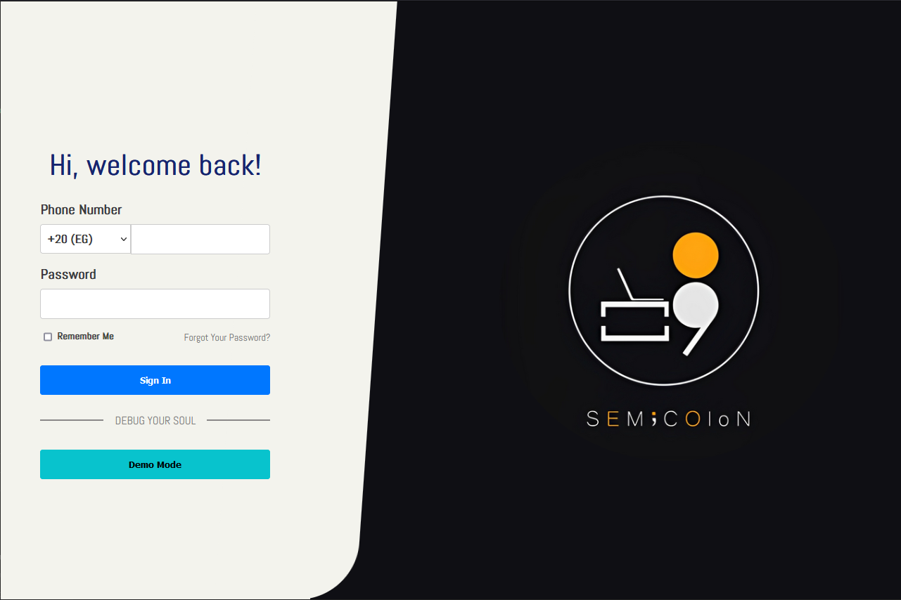
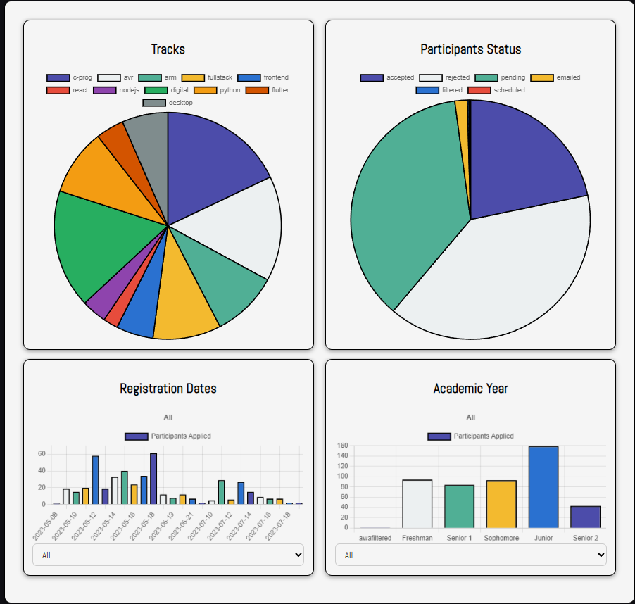
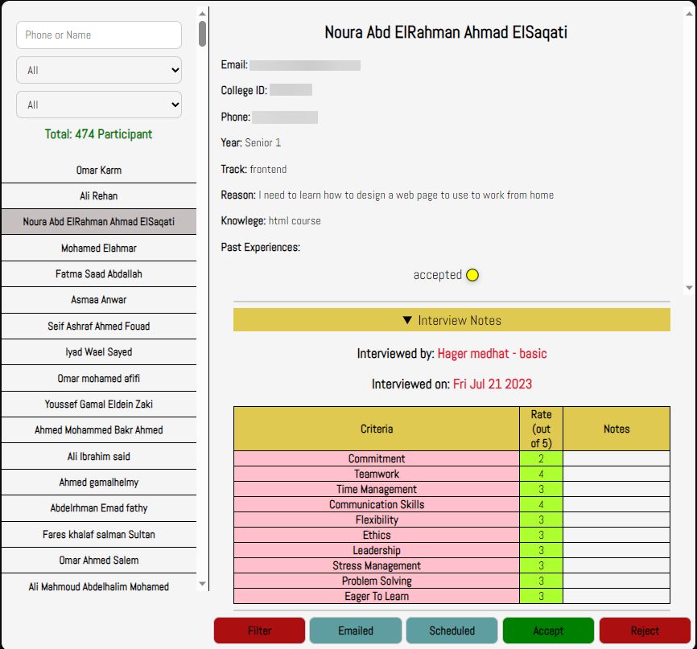
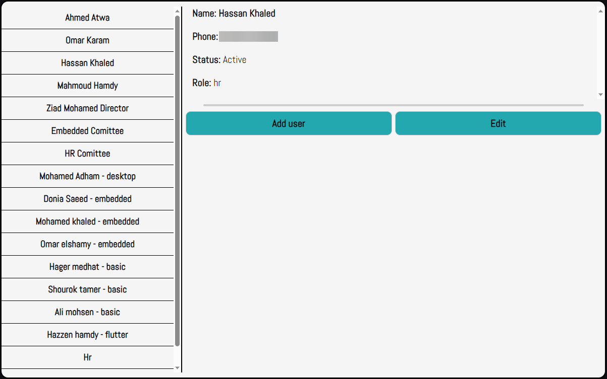

# SemiColon-dashboard-frontend

The dashboard of SemiColon's Registration System.

## SemiColon Registration System
SemiColon's Resgitration system is a full-stack system, consisting of 3 projects: [Registration Website](https://github.com/Deadreyo/SemiColon-registration-frontend), the Dashboard (this), and the [Backend](https://github.com/Deadreyo/SemiColon-backend).

The system is built with React.js, Node.js, Express, and MongoDB (MERN stack) with the addition of TypeScript & Redux. The system is made for recruitment tracking and management, designed to streamline the events' registration process for SemiColon; student organization at Ain Shams University. The application provides a centralized platform for HR & directors to manage registrations & recruitment and track their progress through the registration pipeline, helping them through reviewing the candidate's data, keeping track of their status, interviewing and saving the interview notes, automatically emailing candidates & more.

## SemiColon Registration System Features

- Authentication, Authorization & user accounts
  - The system uses user accounts with different privilege levels for authorization.
  - There are multiple account levels: Viewers, Moderators & Adminstrators, with different levels of control.
  - Adminstrators are able to create accounts through the dashboard, edit them and deactivate them.
  - Uses JWT.
- Logs & action logging for user actions.
  - The system tracks & saves all actions done by all user accounts, ex: editing a candidate status.
- Saving & tracking candidates & registrations.
  - Registrations' data is saved into the database
  - Able to declare & keep track of the candidate's status through the dashboard; the status could be Pending, Scheduled for interivew, Accepted, Rejected, etc.
  - Able to save interview notes about the candidate with multiple predefined criterium & ability to see the interviewer and date of the interview.
  - Filter candidates by track or status.
  - Search for a candidate using name or phone number.
  - Data visualizations inside the dashboard for interesting information such as: tracks most applied to, academic year of candidates, etc.

- System Security: security of the system was guaranteed by:
  - Rate limiting: especially on critical endpoints such as registration (preventing spam registrations) & login.
  - User account Authentication & Authorization.
  - User action logs.
- Automatic mass emails sending.
  - Admins can choose a specific track & status to automatically send an email to all candidates' having that track & status. Ex: sending acceptal emails to all accepted candidates of a specific track.
- Demo Mode
  - The dashboard project was converted into using Redux to get central state management.
  - This allowed a Demo Mode to be implemented, to preview the functionality of the dashboard without exposing private data.

## Deployment

- Registration site: https://asusemicolon.tech/
- Dashboard: https://deadreyo.github.io/SemiColon-dashboard-frontend/
- Backend: https://semicolon-registration-backend.onrender.com/ (might take 2 mins to wake up)

### Demo Mode
An account is needed for entering the Dashboard, however there's a Demo Mode button in the dashboard login page that can be used to view the dashboard and its features with fake data.

## Dashboard Features

Technologies: React.js, TypeScript, Redux-Toolkit, ChartJS & Axios.

Login Page


Data visualizations and charts for registerations' data:


A participants page to show each user's data with the ability to search within them using their name or phone, choose the participants applied in a specific track, or choose the participants with a certain state (accepted, rejected, filtered, emailed, ...).


Admin Dashboard, to view existing user accounts with the ability to create new accounts, edit them, and deactivate them.


## Run Locally

Clone the project

```bash
  git clone https://github.com/Deadreyo/SemiColon-dashboard-frontend.git
```

Go to the project directory

```bash
  cd SemiColon-dashboard-frontend
```

Install dependencies

```bash
  npm install
```

Start the server

```bash
  npm run dev
```

## Authors

- [@bobo122b](https://github.com/bobo122b)
- [@Deadreyo](https://github.com/Deadreyo)
- [@Chady00](https://github.com/Chady00)
- [@Ahmed-Khaled24](https://github.com/Ahmed-Khaled24)
- [@Ofahmy143](https://github.com/Ofahmy143)
